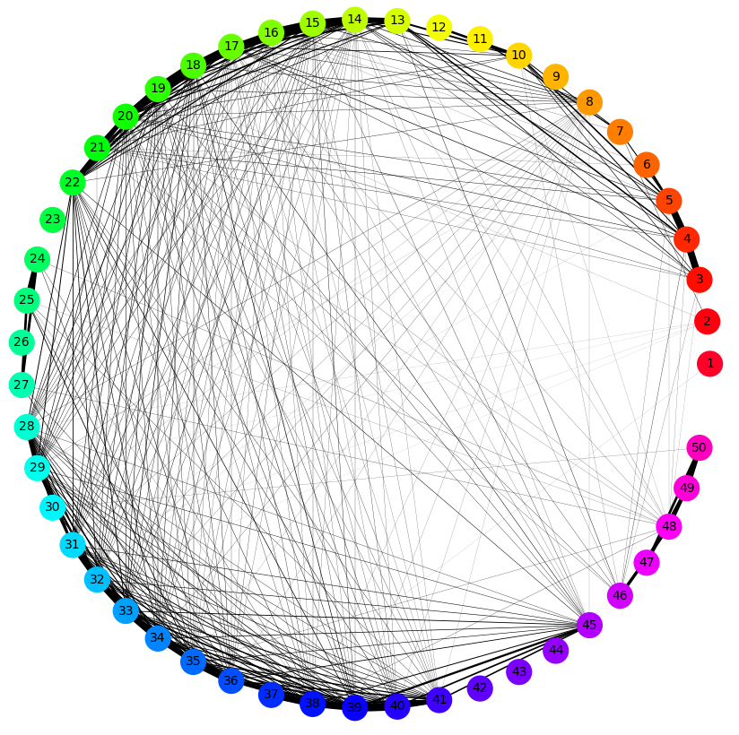

# Entity Graph for German

The entity-graph repository provides an implementation for computing, analyzing and visualizing German texts using the entity graph. 



*Entity graph for first 50 sentences of Die Erbschaft by Arthur Schnitzler.*


## The Entity Graph

The entity graph, first introduced by [Guinaudeau and
Strube (2013)](http://www.aclweb.org/anthology/P13-1010), represents the relations between sentences and entities in a text and thus computes local coherence. We have extended it by adding a syntactic category for possession modifiers and by reducing the weights for entities found in embedded structures. Furthermore, we
extracted a set of graph metrics and show that they are valuable features in text analysis of literary works and author classification.

For more details, please consult the paper by [Suter and Strube (2018)](https://www.oeaw.ac.at/fileadmin/subsites/academiaecorpora/PDF/konvens18_15.pdf). If you would like to use this code for academic work, please cite this paper. 

```
@InProceedings{entgraph2018,  
Title                    = {Extending and Exploiting the Entity Graph for Analysis, Classification and Visualization of German Texts},
  Author                   = {Suter, Julia and Strube, Michael},
  Booktitle                = {Proceedings of the 14th Conference on Natural Language Processing (KONVENS 2018)},
  Year                     = {2018}}
```
## Parsing

This work employs ParZu and CorZu as syntactic parser and coreference resolution systems. For full functionality, install ParZu and CorZu and set the right paths in `settings.py`.

However, the system works without ParZu and CorZu as well. You can pass already parsed texts to the functions as long as they are CoNLL-formatted. 

## Requirements

The system is implemented in Python 3.7 and tested under Ubuntu Linux, but it should work under other environments which have Python installed (no guarantee).

If you want to use the embedded parser functions, please install ParZu and CorZu.

- [ParZu](https://github.com/rsennrich/ParZu)
- [CorZu](https://github.com/dtuggener/CorZu)

For running this code, you will need the following libraries installed:

- numpy
- matplotlib
- scipy
- networkx
- pygobject3
- gtk3
- graph-tool (click [here](http://marlowechung.cn/index.php/2019/01/22/how-to-install-graph-tool-in-anaconda-on-a-linux-server/) for Anaconda installation help)


## Datasets

For evaluating on the sentence reordering tasks, we used the German Tüba/DZ news corpus `Tuebadz-10.0-conll2010_utf8`. 
This corpus provides gold annotations for syntactic parsing and coreference resolution. 
In _0_Datasets/Tueba_DZ_, you find a zipped collection of single texts with gold annotations, unparsed and parsed with Parzu/CorZu. 

- gold_docs
- unparsed_docs 
- parzu_parsed_docs

## How to Run

### Entity Graph for single document

To compute the entity graph and average out degree for a document, you can pass the filename to the  `test_driver` function in `RUN_entity_graph.py`.

Alternatively, you can use the command line. The flag `-p` indicates that the file was pre-parsed and does not need to be passed to ParZu and CorZu.

```
python RUN_entity_graph.py ./1_Info/single_docs/KAFKA_Tuersteher.txt
python RUN_entity_graph.py ./1_Info/single_docs/KAFKA_Tuersteher_parsed.txt -p 
```
Per default, the test driver function will create the entity graph with networkx and save it in the _/2_Results/entity_graph_ directory. You can disable this by setting `draw_single_graph` to False. 

### Evaluation: Sentence Reordering Task

The evaluation script `RUN_evaluation.py` will evaluate the entity graph on the sentence reordering tasks discrimination and insertion as described in the paper. Simply run the script with python. Do not forget to unzip  _0_Datasets/Tueba_DZ.tar.gz_.

In the `config.py`, you can select the one-mode projection. Set *version* to:

- *pu* for P unweighted
- *pw* for P weighted
- *pacc* or *full* for P accumulated

You can also activate or deactivate the possession modifiers and weight reduction extensions. 


Original version
```
possession_modifiers = False
reduce_weights = False
```

Adjusted version
```
possession_modifiers = True
reduce_weights = True
```

Without possession modifiers
```
possession_modifiers = False
reduce_weights = True
```

Without weight reduction
```
possession_modifiers = True
reduce_weights = False
```

Of course, you can change many other settings, for instance the weights for the different syntactic role categories. 

### Correlations between Entity Graph Evaluation Metrics and Text Features 

The Jupyter notebook `Entity Graph Correlations.ipynb`   in _3_Scripts/3_JupyterNotebooks/Entity Graph Correlations_ visualizes the correlations between the entity graph metrics (discrimination accuracy, insertion score and insertion accuracy) and the features of the respective texts. The feature set includes the number of sentences per text, the number of discourse entities per text, percentage of connected sentence pairs, the coherence measure (= average outdegree), average frequencies of discourse entities, and average number of discourse entities per sentence.


### Graph metrics and author/genre classification

From the entity graph, you can extract graph metrics that can be used as features for training a Support Vector Classifier for any text classification. In order to reproduce the classification experiments described in the paper, follow the these instructions.

---

1) Unzip _/0_Datasets/GUTENBERG_parsed_texts.tar.gz_.

2) Run `GET_entity_graphs_for_corpus.py` in order to pre-compute and save the entity graph for each text sample. Select the desired projection version _pu_, _pw_ or _pacc_ in `config.py` 

3) Run `GET_entgraph_features.py` in order to compute and save graph metric features for each saved entity graph. Select the desired projection version _pu_, _pw_ or _pacc_ in `config.py` .

4) Run `GET_baseline_features.py` in order to compute and save the linguistic features used for the baseline system.

5) Run `RUN_classification.py` in order to evaluate the performance of the entity graph and baseline features on text classification. Select feature set, projection type, classification task and other settings in the settings part at the beginning of the script. 

---

Note that the results computed with these scripts may vary slightly from the ones described in the paper due to minor changes and updates. However, the relations in performance between
the different experiments follow the same trends

## Contact

If you have any questions, please do not hesitate to contact me by [email](https://user-images.githubusercontent.com/42718928/60554359-d4f49080-9cfc-11e9-92c9-e81852790ff8.png). 

